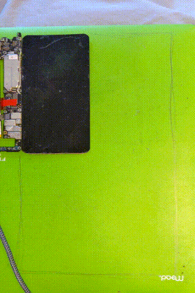

Thanks to Rob Clark (Google/Red Hat), Sean Paul (Google), and John Stultz (Linaro) for helping me figure a couple things out.

This program shuts down Android's native display server (the hwcomposer process) and writes pixels directly to the screen via DRM/KMS, which has replaced the Linux framebuffer device on new Android OS versions. So far, it's working on regular Linux machines that use Xorg as the display server, but I'm still working to get it up and running on Android devices (namely the Google Pixel 4). It might require a small kernel patch. (UPDATE: It works now!) The "dumb buffer" is what DRM allows users to create as a sort of substitute for the old fb0. It should draw random solid colors to the screen for 100 seconds, one color per second. There shouldn't be much tearing, because I imlemented double buffering, but it doesn't synchronize with VSYNC (although that's coming soon), and I'm guessing if you're trying to render faster, there might be tearing. 

I know you need to be running as root to run this on a normal Linux machine, and I think you also do when running it on Android, so you'll need a rooted device. 

To run on a Linux machine, you'll first want to run something like "sudo service gdm3 stop" to shut down Xorg, then switch to a different TTY and run drm_low.c.

To run on an Android device, first build the program for ARM by running something like  
```
arm-linux-gnueabi-gcc -static -march=armv7-a drm_low.c -o [desired executable name]     
```  

Then push the executable to the Android device using ```adb push```. Don't forget, in order to push, you first need to open an ADB shell and run the following:    
```
mount -o rw  
reboot (possibly)  
remount /system  
```  

(now you can make directories in /system/ and push files there)  


Also, make sure you always run    
```
adb root  
```  
after a reboot.

To run the executable, read the 07/30/20 update below and check the IDs for the DRM encoder and CRTC.

Also, double check the line  
```
stop vendor.hwcomposer-2-x
```  
where x can vary but is probably 3 for Android 10 and 4 for Android 11. You can check by running   
```ls /vendor/etc/init/android.hardware.graphics.composer@*```   
and looking at the two numbers. Change this line appropriately in the code.

If the stop command succeeds, the executable should run successfully. Afterwards, run  
```  
start vendor.hwcomposer-2-x
```  
to resume the display service (see tip about this in NOTES).

## UPDATES ##  
(12/21/20): In order to be able to allocate dumb buffers that are larger than the Pixel's screen size, you need to modify the drm_internal_framebuffer_create() function in the DRM driver, found in /private/msm-google/drivers/gpu/drm/drm_framebuffers.c. This function is called for the DRM_IOCTL_MODE_ADDFB ioctl. To avoid a bail due to input dimensions being too big, you need to build a custom kernel and comment out the lines
```  

if ((config->min_width > r->width) || (r->width > config->max_width)) {
    DRM_DEBUG_KMS("bad framebuffer width %d, should be >= %d && <= %d\n",
            r->width, config->min_width, config->max_width);
    return ERR_PTR(-EINVAL);
}
if ((config->min_height > r->height) || (r->height > config->max_height)) {
    DRM_DEBUG_KMS("bad framebuffer height %d, should be >= %d && <= %d\n",
            r->height, config->min_height, config->max_height);
    return ERR_PTR(-EINVAL);
}
```  
then the 2x multiplier in lines 390, 391, etc. of my program should work.  


(07/30/20): The program is now finished; everything's working. A kernel mod could do the job, but an easier way is to just do some debugging of the DRM driver using printk, or, even easier, use the modetest tool. Specifically, you need to find out what the correct encoder ID and corresponding CRTC ID are for DSI-1. (You'll see this as one of the encoder types in the modetest output.) For the Pixel, my encoder was 27, and the corresponding CRTC was 127 (it might be 125 for Android 11). It seems like the latest versions of Android for the Pixel 4 come with libdrm in /external; to build the modetest executable, set up the AOSP build normally (using lunch, etc.), then cd into /external/libdrm/tests/modetest and run 'mma'. When the build finishes it should tell you where it stored the output executable; mine was in /home/[USER]/Documents/aosp/working/out/target/product/flame/data/nativetest/modetest. Push the executable to /system/bin on the Pixel device, then cd into bin and run   
```
./modetest -M msm_drm 
```  
At the very beginning, you should see the list of encoders; you want the ID corresponding to the DSI (Display Serial Interface) encoder. For some reason, when I was originally developing the drm_low file, upon calling DRM_IOCTL_MODE_GETCONNECTOR, the encoder ID for the connector was coming up null (0). You need to override it with the encoder ID you found from modetest, like I did around line 300. Similarly, after DRM_IOCTL_MODE_GETENCODER, the CRTC id for the encoder was coming back as 0, so override that like I did around line 585. Getting the correct CRTC ID from modetest is a little uncertain, but I'm guessing it's always the first CRTC listed under the CRTC section.  

If you have the capacity to build kernels for Android, I found that debugging the DRM driver with printk was pretty helpful. You can access all of the necessary driver files in /private/msm-google/drivers/gpu/drm. If you want to verify the correct encoder ID for DSI, you can add printk statements in drm_encoder.c in the drm_encoder_init() function and look at encoder->base.id. If you want to verify the correct CRTC, you can add printk statements in drm_crtc.c in the drm_crtc_init_with_planes() function and look at crtc->base.id.     

(07/18/20): Running on Android devices probably requires a kernel patch in order to access the encoder. I'm working on it but won't be able to get around to posting it for another week or so.  

## NOTES ##  
* One thing to note is that, at least on the Pixel 4 with AOSP, the rendering won't work unless you implement double buffering, as done in this example. This must have something to do with VSYNC and the fact that this DSI encoder is in command mode, so it's not flushing out the frames/refreshing correctly. 

* For some reason, after I run ```stop vendor.hwcomposer-2-x```, I often have to run   
```
start vendor.hwcomposer-2-3
```  
and immediately run the program (as soon as the "android" logo appears on the screen) in order to get it working. So if the program seems to run to completion with no errors, but nothing shows on the screen, try that.

* You should see the "android" logo appear shortly after running ```start vendor.hwcomposer-2-3```, indicating that the display server is starting up again. If nothing happens after running the command, I've found that it usually works to just tap the power button once or run 
```
input keyevent 26
```  

* mmap64 is required...some knowledgeable people tell me that has something to do with bionic?   


## PREVIEWS ##




